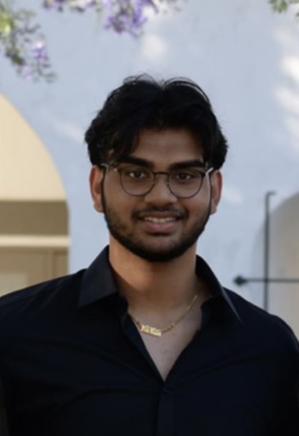

# practice-Vikram-V

Hello Everyone!

My name is Vikram Venkatesh and I am an incoming freshman at UCSD. My major is Data Science and I am in Warren College. I am very excited to learn more about Algorithmic Problem Solving and Machine Learning during SPIS, and hopefully implement them into one cohesive and purposeful final project. My hobbies include going to the gym, playing basetball, and hanging out with friends. During non-academic SPIS hours, I would love to play GeoGuessr or any games that require team collaboration.

